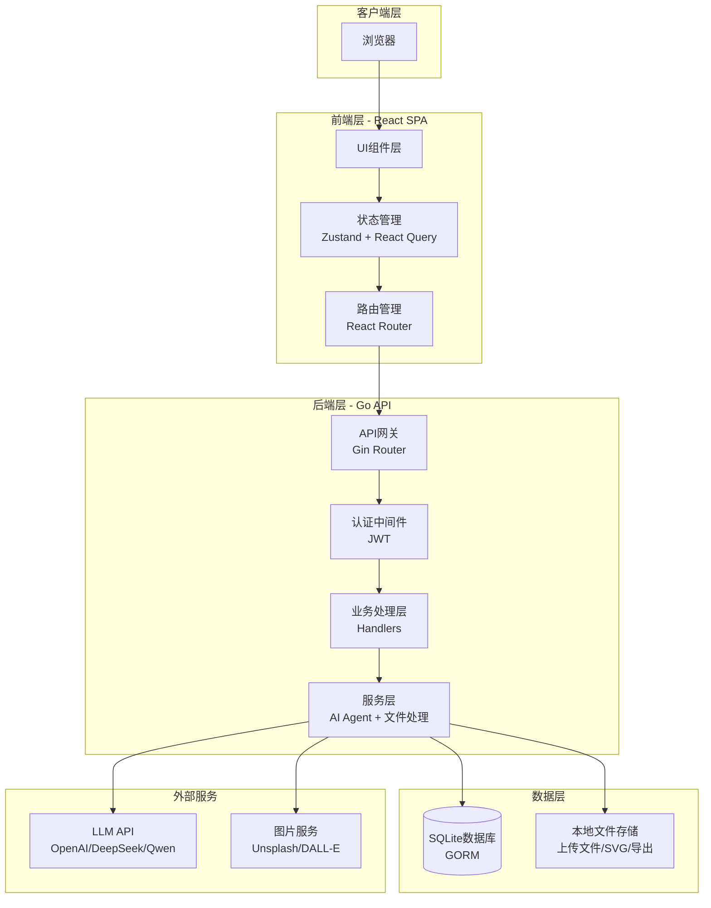
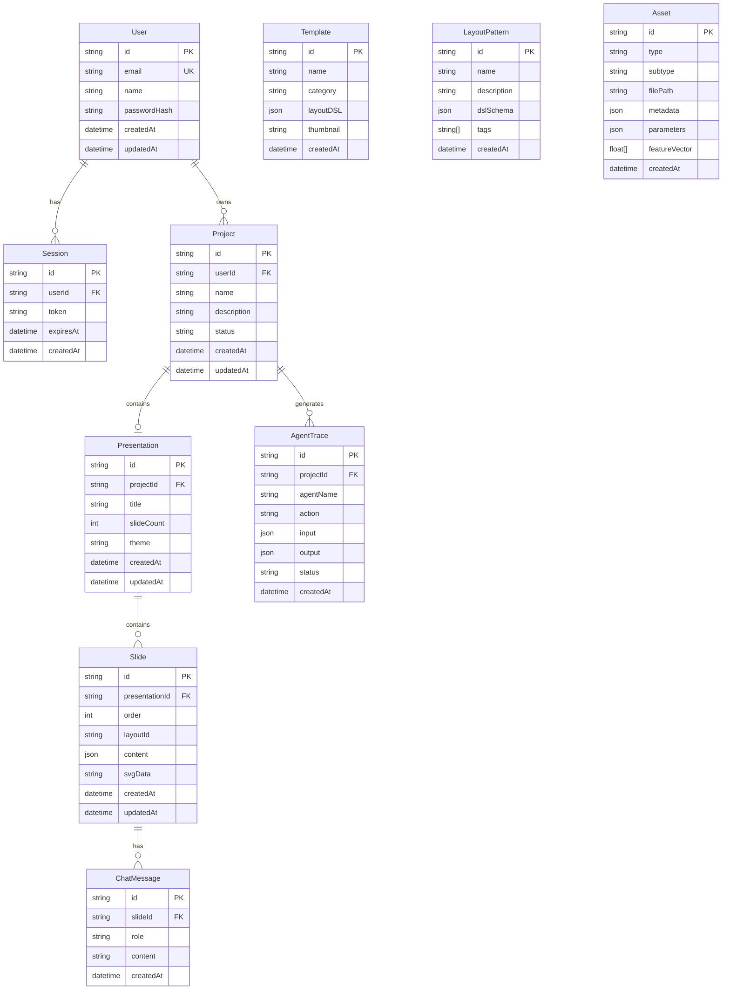
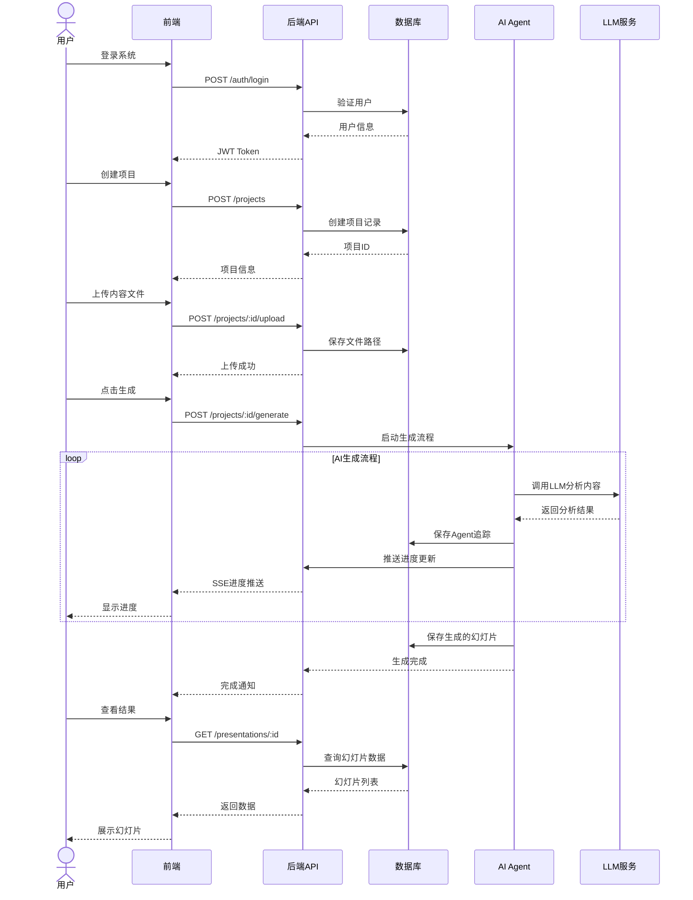
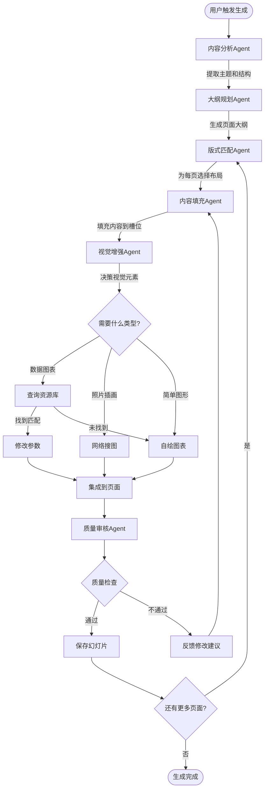
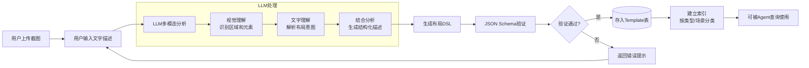
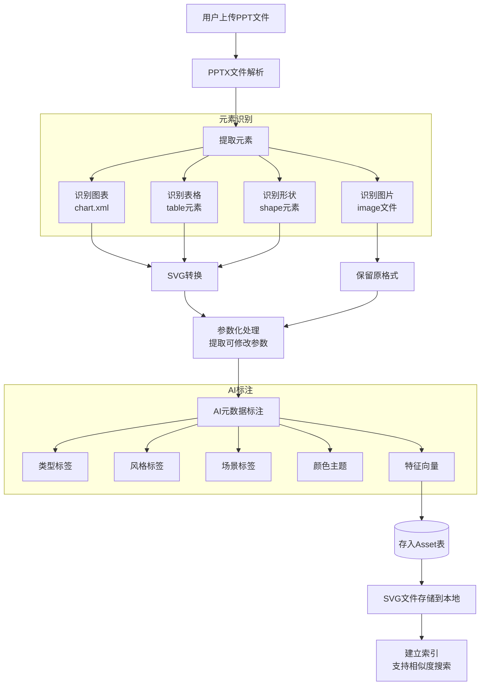
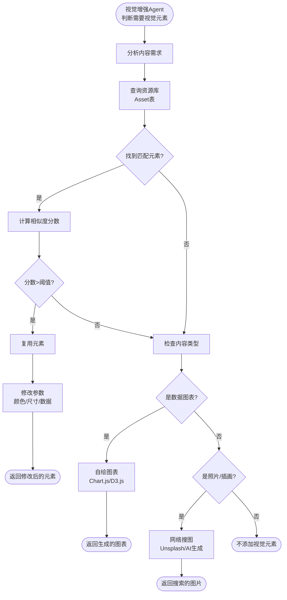
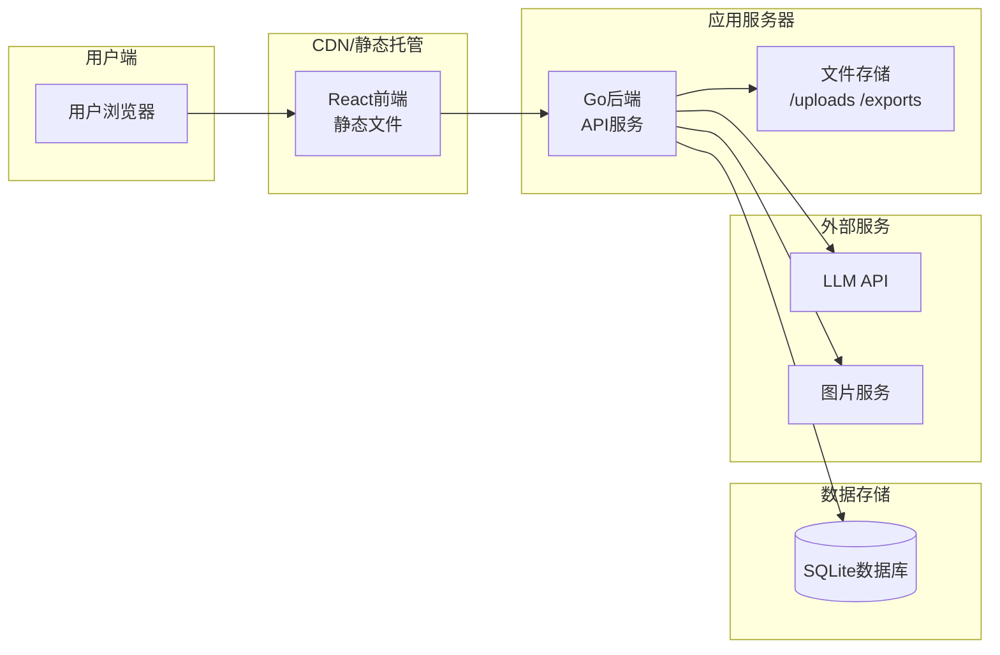

# DeckGenie 技术架构文档

## 1. 系统架构总览

### 1.1 整体架构

DeckGenie 采用前后端分离架构，前端使用 React SPA，后端使用 Go API 服务。



### 1.2 技术栈

**前端技术栈**：
- React 19 - UI框架
- TypeScript 5 - 类型安全
- Vite 8 - 构建工具
- React Router v7 - 路由管理
- Zustand - 轻量级状态管理
- React Query - 服务端状态管理
- Tailwind CSS 4 - 样式框架
- Axios - HTTP客户端

**后端技术栈**：
- Go 1.21+ - 编程语言
- Gin - HTTP框架
- GORM - ORM框架
- SQLite - 数据库
- JWT - 身份认证
- bcrypt - 密码加密

**AI和集成**：
- LLM API - 多模态大语言模型
- 图片API - 图片搜索和生成
- PPTX库 - PPT文件解析和生成

### 1.3 架构优势

**前后端分离的优势**：
- 独立部署和扩展：前端可部署到CDN，后端可独立扩容
- 技术栈灵活：各层使用最适合的技术
- 团队协作：前后端团队可并行开发
- 清晰边界：通过API契约明确定义接口

**技术选型理由**：
- Go：高性能、并发友好、适合API服务
- React：成熟生态、组件化、开发效率高
- SQLite：轻量级、零配置、适合MVP阶段
- JWT：无状态认证、易于扩展

---

## 2. 数据库设计

### 2.1 数据模型ER图



### 2.2 核心表说明

**User（用户表）**：
- 存储用户基本信息和认证凭据
- passwordHash使用bcrypt加密（cost=12）

**Project（项目表）**：
- 用户创建的PPT项目
- status字段：draft（草稿）、generating（生成中）、completed（已完成）

**Presentation（演示文稿表）**：
- 每个项目对应一个演示文稿
- 存储整体配置（主题、页数等）

**Slide（幻灯片表）**：
- 单个幻灯片的内容和布局
- content字段存储JSON格式的结构化内容
- svgData字段存储渲染后的SVG

**Template（模板表）**：
- 布局模板库
- layoutDSL字段存储布局描述语言

**Asset（资源表）**：
- 从PPT提取的可复用元素
- featureVector用于相似度搜索
- metadata存储标签、风格、场景等信息

**AgentTrace（Agent追踪表）**：
- 记录AI Agent的执行过程
- 用于调试和展示生成进度

---

## 3. API接口设计

### 3.1 API规范

**Base URL**：`/api/v1`

**认证方式**：JWT Token（Bearer Token）

**响应格式**：
```json
{
  "success": true,
  "data": {...},
  "message": "操作成功"
}
```

**错误格式**：
```json
{
  "success": false,
  "error": {
    "code": "ERROR_CODE",
    "message": "错误描述"
  }
}
```

### 3.2 核心接口列表

**认证接口**：
- `POST /auth/register` - 用户注册
- `POST /auth/login` - 用户登录
- `POST /auth/logout` - 用户登出
- `GET /users/me` - 获取当前用户信息

**项目管理接口**：
- `GET /projects` - 获取项目列表（分页）
- `GET /projects/:id` - 获取项目详情
- `POST /projects` - 创建项目
- `PUT /projects/:id` - 更新项目
- `DELETE /projects/:id` - 删除项目

**内容上传接口**：
- `POST /projects/:id/upload` - 上传文件（TXT/PDF/DOCX）
- `POST /projects/:id/content` - 提交文本内容
- `POST /projects/:id/url` - 提交URL

**生成接口**：
- `POST /projects/:id/generate` - 触发AI生成
- `GET /projects/:id/progress` - 获取生成进度（SSE）
- `GET /projects/:id/presentation` - 获取生成结果

**编辑接口**：
- `GET /presentations/:id/slides` - 获取幻灯片列表
- `PUT /slides/:id` - 更新幻灯片内容
- `POST /slides/:id/chat` - AI助手对话

**模板和资源接口**：
- `GET /templates` - 获取模板列表
- `POST /templates` - 创建模板（上传截图+描述）
- `POST /assets/extract` - 上传PPT提取元素
- `GET /assets` - 获取资源列表

**导出接口**：
- `POST /presentations/:id/export` - 导出为PPTX

### 3.3 典型用户流程时序图



---

## 4. AI生成流程

### 4.1 多Agent协作架构



### 4.2 Agent职责说明

**内容分析Agent**：
- 解析用户上传的原始内容（文本/PDF/URL）
- 识别内容类型（数据报告/故事叙述/教学材料等）
- 提取关键信息、实体、关系
- 输出：结构化的内容摘要

**大纲规划Agent**：
- 根据内容和目标页数规划演示结构
- 确定每页的核心信息和辅助信息
- 规划页面间的逻辑关系（递进/并列/对比）
- 输出：页面大纲列表

**版式匹配Agent**：
- 查询布局模板库（Template表）
- 根据页面内容类型匹配最合适的布局
- 考虑整体视觉连贯性
- 输出：每页的layoutId

**内容填充Agent**：
- 将内容分配到布局的各个槽位
- 优化文字长度和表达方式
- 确保内容适配布局约束
- 输出：结构化的页面内容JSON

**视觉增强Agent**：
- 判断是否需要视觉元素
- 执行三路决策：复用/自绘/搜图
- 生成或获取视觉元素
- 输出：完整的页面数据（含视觉元素）

**质量审核Agent**：
- 检查内容完整性（是否有遗漏）
- 验证布局合理性（文字是否溢出）
- 评估视觉一致性（风格是否统一）
- 输出：通过/不通过 + 修改建议

### 4.3 LLM集成方案

**API兼容性**：
- 支持OpenAI API格式
- 兼容DeepSeek、Qwen、GLM等国产模型
- 统一的请求/响应封装

**Prompt工程**：
- 每个Agent有独立的System Prompt
- 使用Few-shot示例提升输出质量
- 强制JSON输出格式（JSON Schema验证）

**错误处理**：
- API调用失败自动重试（最多3次）
- 超时设置（30秒）
- 降级策略（使用默认模板）

---

## 5. 布局模板系统

### 5.1 布局DSL生成流程



### 5.2 布局DSL结构

布局DSL是JSON格式的布局描述语言，包含以下核心字段：

**基础信息**：
- layoutId：唯一标识
- name：布局名称
- category：分类（cover/content/chart/summary等）
- description：描述

**画布定义**：
- canvas：画布尺寸（1920x1080）

**区域定义**：
- regions：区域数组，每个区域包含：
  - id：区域标识
  - type：类型（container/image/text等）
  - bounds：位置和尺寸（x, y, width, height）
  - style：样式（背景、边框等）
  - slots：内容槽位数组

**槽位定义**：
- type：内容类型（title/text/bullet-list/image/chart等）
- constraints：约束条件（maxLines/maxItems/fontSize等）

### 5.3 布局匹配算法

**匹配维度**：
1. 内容类型匹配：页面需要展示什么类型的内容
2. 元素数量匹配：需要几个主要元素
3. 视觉风格匹配：整体风格是否一致
4. 场景匹配：适用场景是否符合

**匹配流程**：
1. 版式匹配Agent接收页面内容描述
2. 查询Template表，筛选候选布局
3. 计算每个候选布局的匹配分数
4. 选择分数最高的布局
5. 如果分数过低，使用默认布局

---

## 6. 元素提取和复用

### 6.1 PPT元素提取流程



### 6.2 元素复用决策流程



### 6.3 元素复用策略

**策略1：复用已有元素**
- 适用场景：资源库中有相似元素
- 优点：风格统一、符合企业规范、速度快
- 实现：查询Asset表 → 相似度匹配 → 参数修改

**策略2：自绘新元素**
- 适用场景：简单图表、流程图、基础图形
- 优点：完全定制、精确匹配需求
- 实现：使用图表库（Chart.js/D3.js）生成SVG

**策略3：网络搜图**
- 适用场景：照片、复杂插画、特殊场景
- 优点：内容丰富、视觉冲击力强
- 实现：调用图片API或AI图像生成

**决策优先级**：
1. 优先尝试复用（成本低、风格统一）
2. 其次自绘（可控性强）
3. 最后搜图（成本高、不可控）

### 6.4 相似度搜索

**特征向量生成**：
- 使用视觉模型（CLIP等）提取元素的特征向量
- 向量维度：512或1024维
- 存储在Asset表的featureVector字段

**相似度计算**：
- 使用余弦相似度计算
- 阈值设定：>0.8为高度相似，>0.6为中度相似
- 结合元数据标签进行二次筛选

**性能优化**：
- 考虑使用向量数据库（Milvus/Qdrant）
- 或使用PostgreSQL的pgvector扩展
- 当前MVP阶段可使用简单的线性搜索

---

## 7. 关键技术实现

### 7.1 文件上传和处理

**上传流程**：
1. 前端使用FormData上传文件
2. 后端接收并验证文件类型和大小
3. 保存到本地文件系统（/uploads目录）
4. 记录文件路径到数据库

**文件解析**：
- TXT：直接读取文本内容
- PDF：使用PDF解析库提取文本
- DOCX：解析XML结构提取内容
- PPTX：解析XML结构提取元素

### 7.2 PPTX导出

**导出流程**：
1. 从数据库读取Slide数据
2. 根据布局DSL和内容生成PPTX结构
3. 使用PPTX库创建文件
4. 保存到/exports目录
5. 返回下载链接

**技术选型**：
- Go：使用unioffice或类似库
- 或调用Python脚本（python-pptx）

### 7.3 实时进度推送

**技术方案**：Server-Sent Events (SSE)

**实现流程**：
1. 客户端建立SSE连接：GET /projects/:id/progress
2. 后端保持连接，定期推送进度
3. Agent执行时更新进度到内存或Redis
4. SSE推送进度数据到前端
5. 前端实时更新UI

**进度数据格式**：
```json
{
  "stage": "content_analysis",
  "progress": 20,
  "message": "正在分析内容...",
  "timestamp": "2026-04-04T10:30:00Z"
}
```

### 7.4 前端状态管理

**Zustand（客户端状态）**：
- 用户认证状态（token、用户信息）
- UI状态（模态框、侧边栏等）
- 临时表单数据

**React Query（服务端状态）**：
- API数据缓存
- 自动重新获取
- 乐观更新
- 分页和无限滚动

**状态同步**：
- 登录后将token存储到localStorage
- 页面刷新时从localStorage恢复状态
- 登出时清除所有状态

---

## 8. 部署架构

### 8.1 开发环境

**前端开发**：
```bash
cd frontend-react
npm install
npm run dev  # 启动开发服务器（端口5173）
```

**后端开发**：
```bash
cd backend-go
go mod tidy
go run cmd/server/main.go  # 启动API服务器（端口8080）
```

**一键启动**：
```bash
./start-dev.sh  # 同时启动前后端
```

### 8.2 生产部署



**前端部署**：
- 构建：`npm run build`
- 部署到：Vercel / Netlify / Nginx静态托管
- 配置环境变量：VITE_API_BASE_URL

**后端部署**：
- 构建：`go build -o server cmd/server/main.go`
- 部署到：Linux服务器 / Docker容器
- 配置环境变量：PORT、JWT_SECRET、DATABASE_PATH
- 使用systemd或supervisor管理进程

**数据库**：
- SQLite文件存储在服务器本地
- 定期备份数据库文件
- 考虑迁移到PostgreSQL（生产环境）

---

## 9. 技术演进路线

### 9.1 当前阶段（MVP）

**已完成**：
- ✅ 前后端基础架构
- ✅ 用户认证系统
- ✅ 项目管理CRUD
- ✅ 所有页面UI

**进行中**：
- 🚧 文件上传和解析
- 🚧 基础AI生成流程
- 🚧 幻灯片渲染

### 9.2 下一阶段

**Phase 2：AI增强**
- 完整的多Agent协作系统
- LLM集成和Prompt优化
- 实时进度推送
- AI聊天助手

**Phase 3：模板和资源**
- 布局DSL生成器
- PPT元素提取引擎
- 元素复用系统
- 初始资源库建设

**Phase 4：优化和扩展**
- 性能优化（缓存、并发）
- 数据库迁移到PostgreSQL
- 协作功能
- 企业级特性

### 9.3 技术债务和优化方向

**性能优化**：
- 引入Redis缓存（LLM响应、资源查询）
- 数据库查询优化（索引、分页）
- 前端代码分割和懒加载

**可扩展性**：
- 微服务拆分（生成服务、导出服务）
- 消息队列（异步任务处理）
- 负载均衡（多实例部署）

**可观测性**：
- 日志系统（结构化日志）
- 监控告警（Prometheus + Grafana）
- 链路追踪（OpenTelemetry）

---

**文档版本**：v1.0
**最后更新**：2026-04-04
**维护者**：DeckGenie Team
